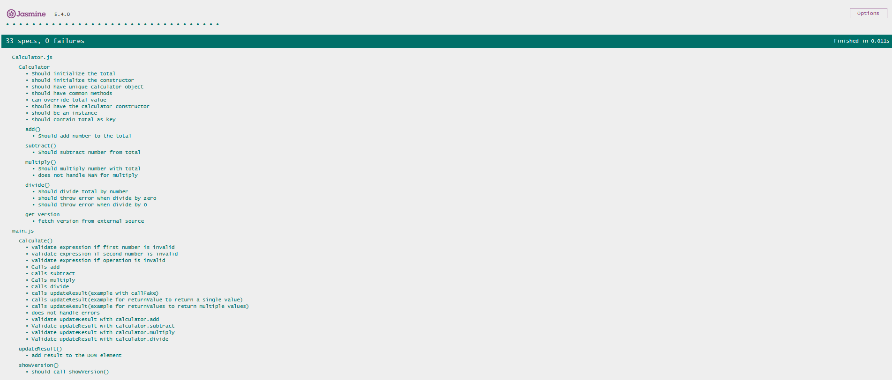
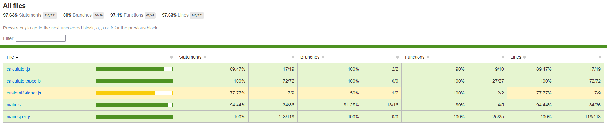

# Vanilla calculator with Jasmine

## About
A pure front end project that demonstrates how Jasmine can be used for unit testing. In particular, we can test the code logic and UI in isolation
using spyOn to mock the dependencies. Moreover, karma is used for test coverage. 

## Technology
Javascript, HTML, Jasmine, Karma.

## Screenshots

